

## AirTicket
AirTicket Client is an android for an specific airline company. ✈️ .  
Backend is hosted at: https://github.com/rohanprasadofficial/AirTicket. 
Consist of both the Interfaces:
- User
- Admin
### System Requirements

1. Android Studio (Above 3.0).
2. API Level >23.

### Steps to run
1. Download/Clone the repository to your local system.
2. Just open existing project with your Android Studio.
3. Add Server URL to API/APIClient.java

### Screenshots

  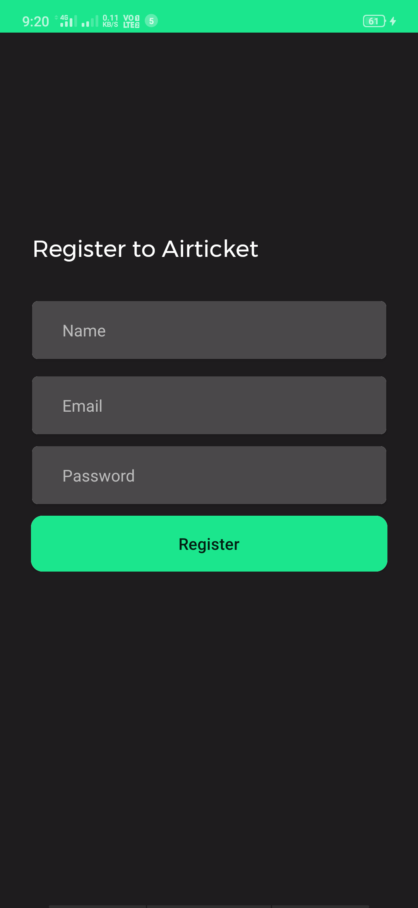
  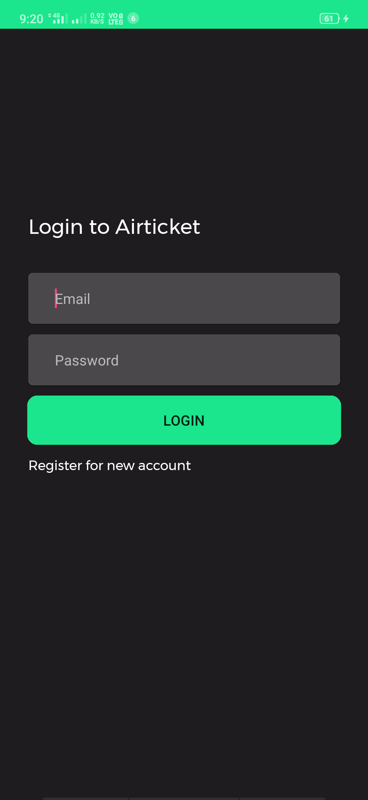
  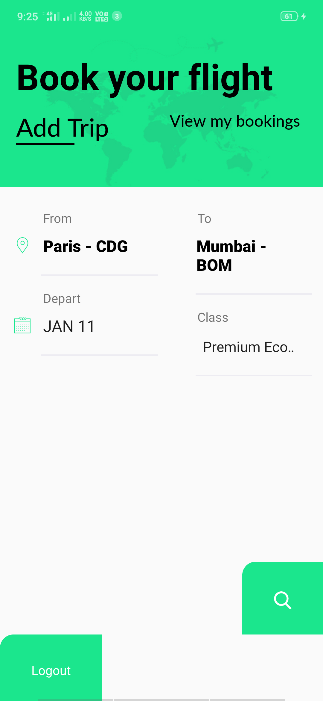

 
 
 

  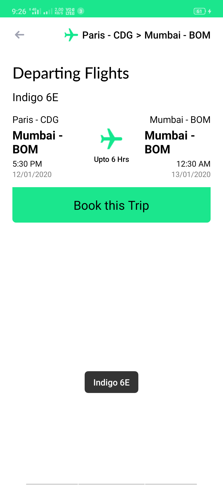
  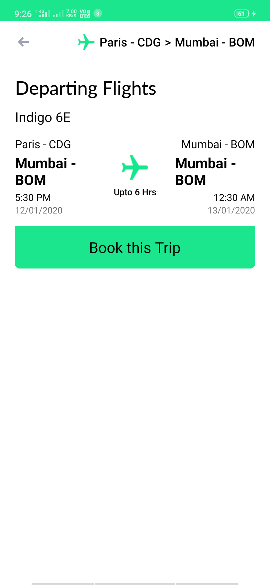
  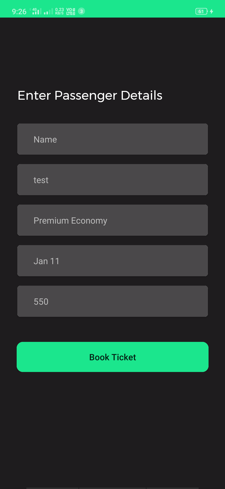

 
 

  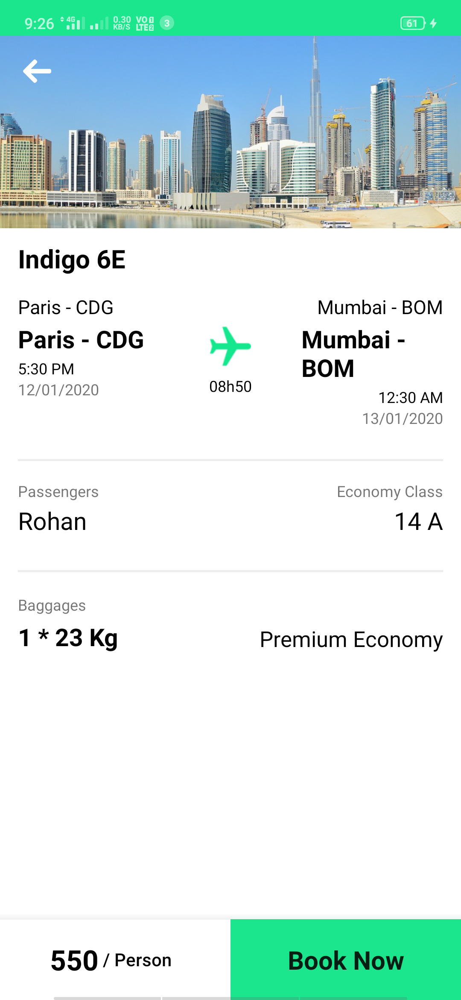
  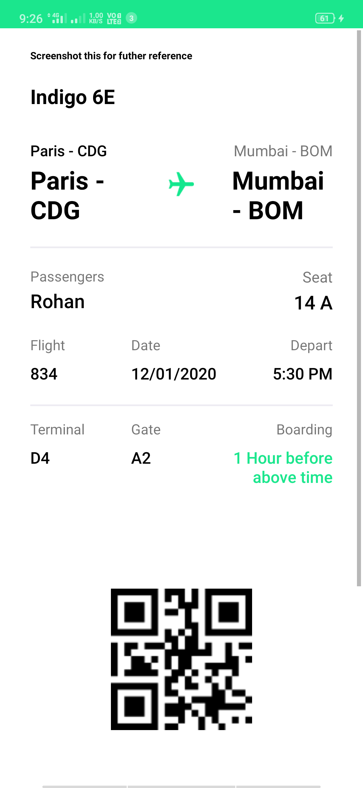
  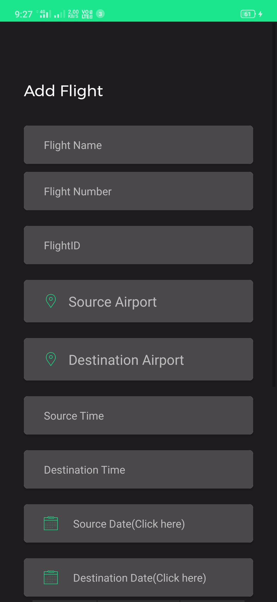

 
 

  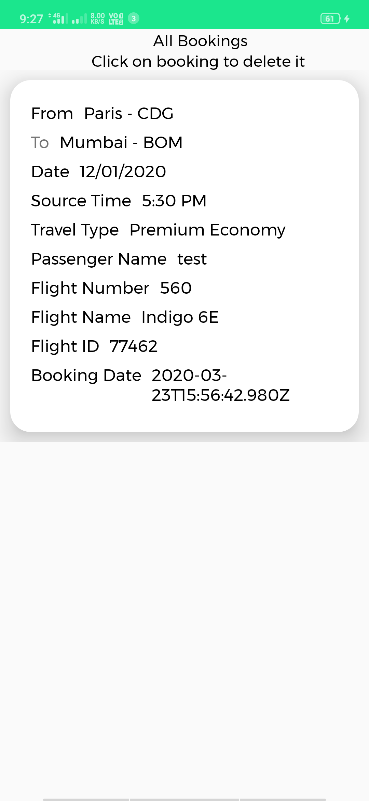
  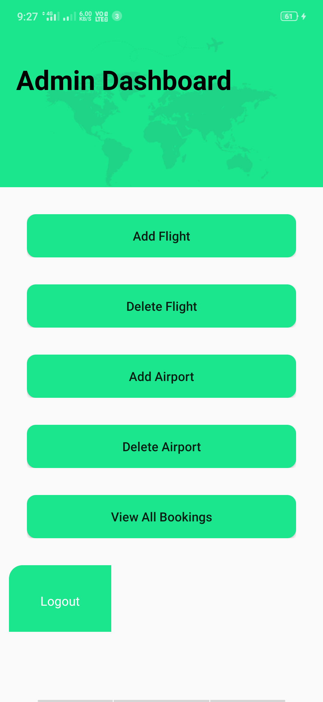

### Concept
Specific airlines can have their own booking system to maintain business properly without depending on third party.

### Credits
1. Google Fonts - Fonts  
2. Flaticon - Logos & Icons  

Would love to receive PR , Bugs and Improvements.  
**Made with &#10084; by Rohan**
